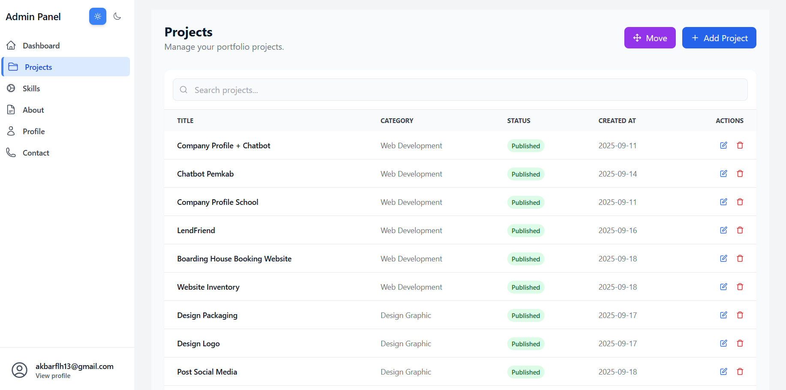
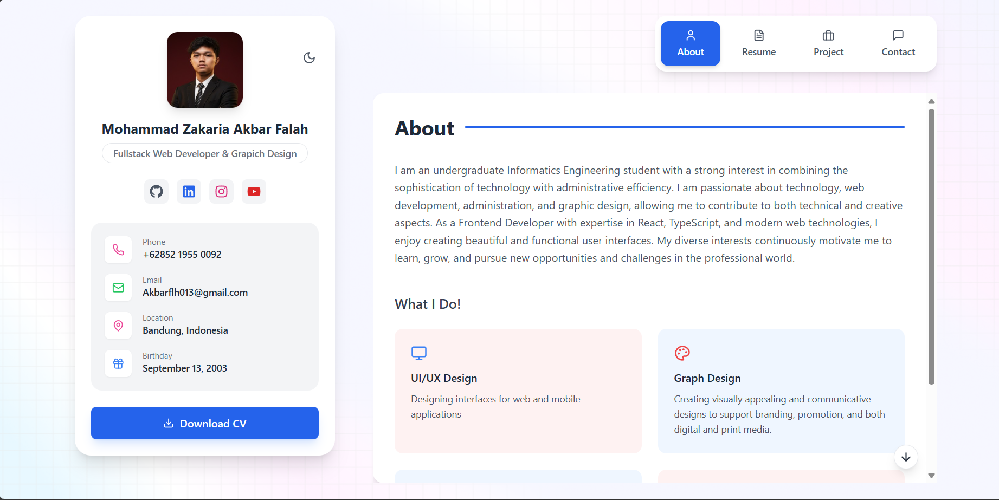
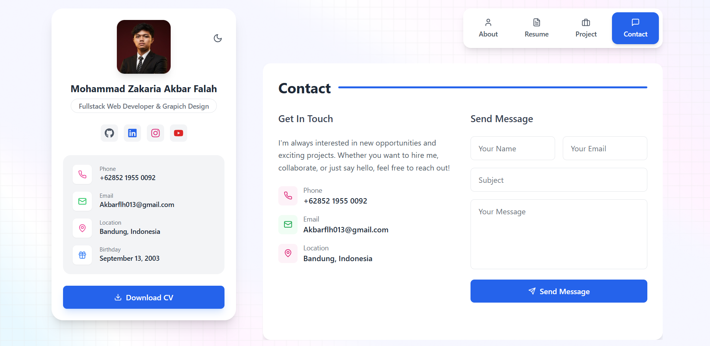
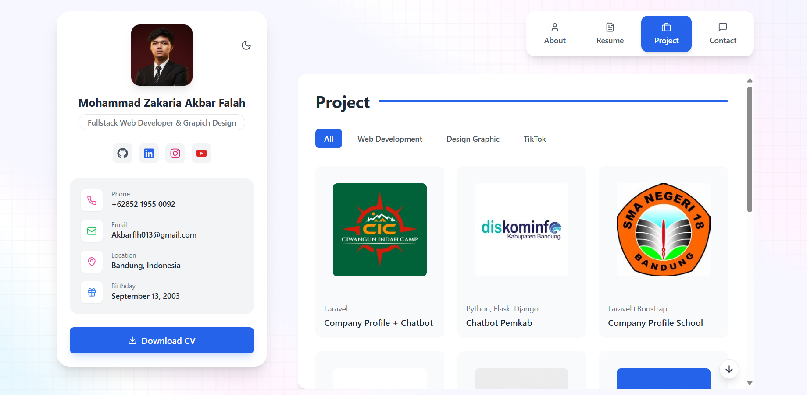
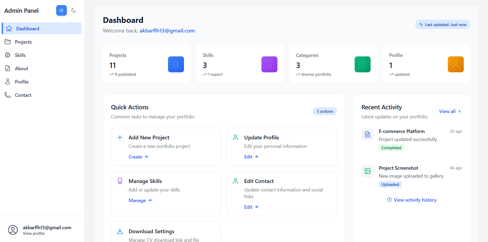
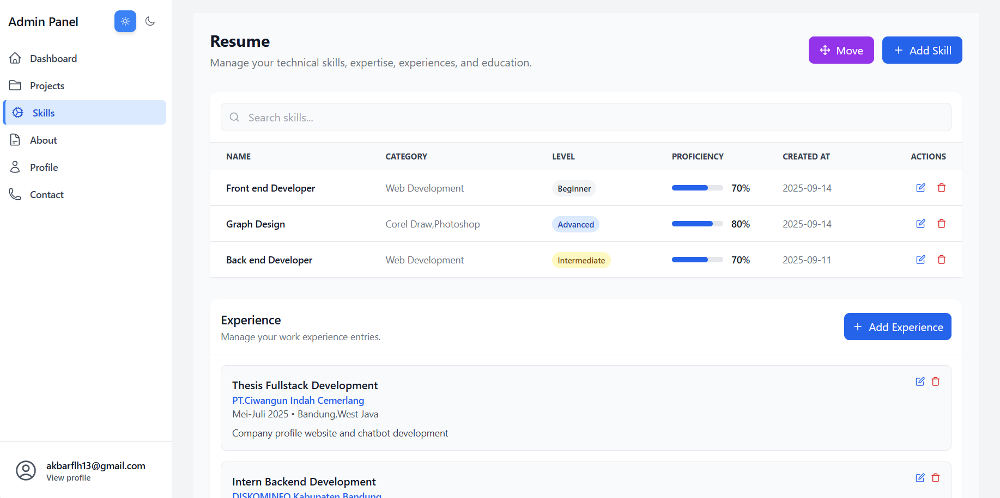
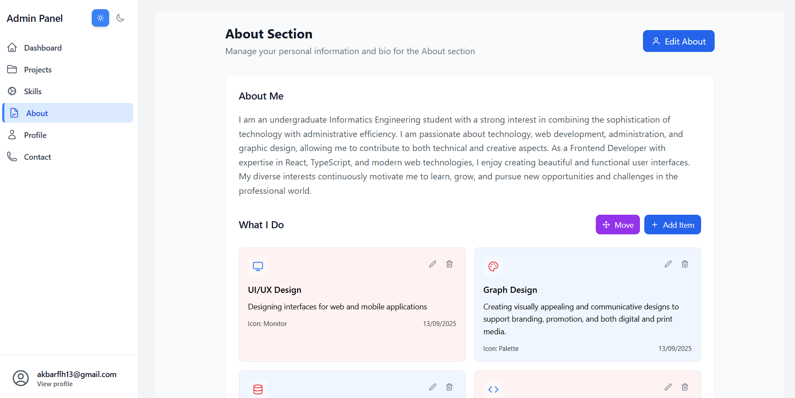

# Portfolio & Admin Dashboard (Firebase)

## Features

- **Firebase Authentication**
  - Admin-only write access using custom claims
  - Shared auth state across public app and admin

- **Firestore Data**
  - Real-time CRUD for Projects, Resume (Skills, Experience, Education, Knowledge), Profile, Sections, About (What I Do)
  - Consistent string IDs for all docs

- **Firebase Storage**
  - Public-read images, admin-only writes
  - Image cropper for profile avatar

- **Reorder/Move Feature (Admin)**
  - Projects: reorder categories and projects
  - Resume: reorder Skills, Experience, Education, Knowledge
  - About: reorder What I Do items
  - Profile: reorder Social Media Links
  - Fixed viewport shows 10 rows; scroll if more than 10

## Getting Started

### Prerequisites

- Node.js 18+
- npm or yarn
- Firebase project (Web App credentials)

### Installation

1. Clone the repository
2. Install dependencies:
   ```bash
   npm install
   ```
3. Create `.env` in project root and fill with your Firebase Web App config (see next section)
4. Start the development server:
   ```bash
   npm run dev
   ```

## Environment Variables

Create a `.env` file in the root directory with the following variables from your Firebase Web App settings:

```
VITE_FIREBASE_API_KEY=your-api-key
VITE_FIREBASE_AUTH_DOMAIN=your-project.firebaseapp.com
VITE_FIREBASE_PROJECT_ID=your-project-id
VITE_FIREBASE_STORAGE_BUCKET=your-project.appspot.com
VITE_FIREBASE_MESSAGING_SENDER_ID=sender-id
VITE_FIREBASE_APP_ID=app-id
```
## Available Scripts

- `npm run dev` - Start development server
- `npm run build` - Build for production
- `npm run preview` - Preview production build
- `npm run lint` - Run ESLint
- `npm run format` - Format code with Prettier

## Project Structure
```
src/
  admin/
    components/     # Reusable UI components
    context/       # React context providers
    hooks/         # Custom React hooks
    lib/           # Utility functions
    pages/         # Page components
    services/      # API services
    types/         # TypeScript type definitions
    utils/         # Helper functions
```
## Authentication Flow

1. User visits `/admin`
2. If not authenticated, redirect to login
3. After login, Firebase Auth session is shared across public/admin apps
4. Firestore rules: public read, admin-only write using custom claims
5. Logout clears Firebase auth state

## Reorder/Move Feature (Admin)

- **Projects** (`src/admin/pages/ProjectsPage.tsx`)
  - Open Move: reorder categories (drag) and projects (up/down)
  - Saves category order to `portfolio_settings.categories_order`
  - Saves project order via `order_index`

- **Resume** (`src/admin/pages/ResumePage.tsx`)
  - Tabs: Skills, Experiences, Educations, Knowledge
  - Up/down controls; persists `order_index` for entities and array order for Knowledge

- **About – What I Do** (`src/admin/pages/AboutPage.tsx`)
  - Up/down controls; persists `order_index`

- **Profile – Social Media Links** (`src/admin/pages/ProfilePage.tsx`)
  - Up/down controls; updates array order; persisted when clicking “Save Changes”

All Move modals use a fixed table viewport (~10 rows). If more than 10 items, the list becomes scrollable; with fewer items, the height stays consistent.

## Screenshots

Berikut tampilan halaman aplikasi (public) dan dashboard admin. Simpan file gambar di folder `public/screenshots/` lalu sesuaikan nama file pada README ini jika berbeda.

### Public Portfolio

- Halaman Resume

 

- Halaman About

  

- Halaman Contact

  

- Halaman Projects

  

### Admin Dashboard

- Dashboard Utama

  

- Manajemen Projects

  

- Manajemen Resume (Skills, Experience, Education, Knowledge)

  

- Halaman About (What I Do & Bio)

  


## Contributing

1. Create a new branch
2. Make your changes
3. Submit a pull request

## License

MIT